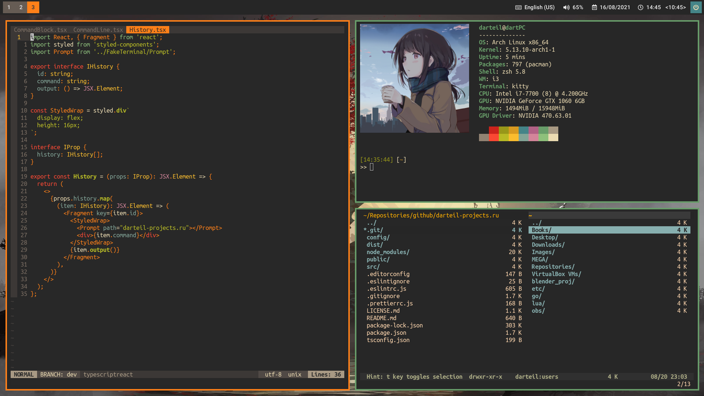
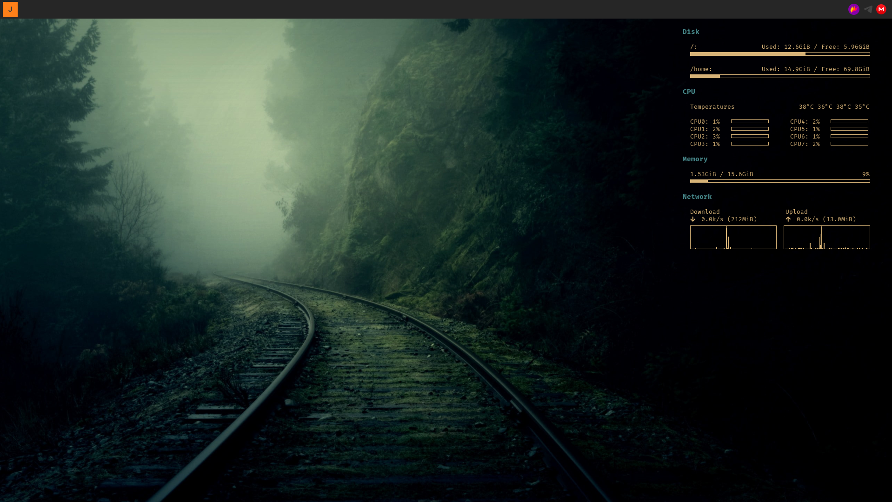

## ~/.dotfiles

#### Programs

| Program                             | Name                                                                     |
| :---                                | :---                                                                     |
| Linux Distribution                  | [Arch Linux](https://www.archlinux.org/)                                 |
| Window Manager                      | [i3-gaps](https://github.com/Airblader/i3)                               |
| Bar                                 | [polybar](https://github.com/jaagr/polybar)                              |
| Program Launcher                    | [rofi](https://github.com/DaveDavenport/rofi)                            |
| Wallpaper Setter                    | [feh](https://github.com/derf/feh)                                       |
| Web Browser                         | [Vivaldi](https://vivaldi.com)               |
| Code Editor                         | [Nvim](https://neovim.io/)                                               |
| Shell                               | [zsh](https://www.zsh.org/)                                              |
| Terminal Emulator                   | [Kitty](https://sw.kovidgoyal.net/kitty/)                                |

#### Dotfiles Manager

Managed using dotdrop.  
Check out the tool at https://github.com/deadc0de6/dotdrop.

#### Installation

```
git clone --recursive https://github.com/darteil/dotfiles ~/dotfiles

cd ~/.dotfiles
pip3 install --user -r dotdrop/requirements.txt

./dotdrop/bootstrap.sh
./dotdrop.sh install --profile=default
```

#### Screenshots
Home


Code Editor, system info


Second monitor


#### License

MIT License, Copyright (c) 2019-2021 Romanov Yuri
