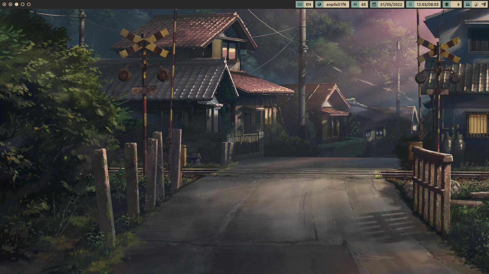
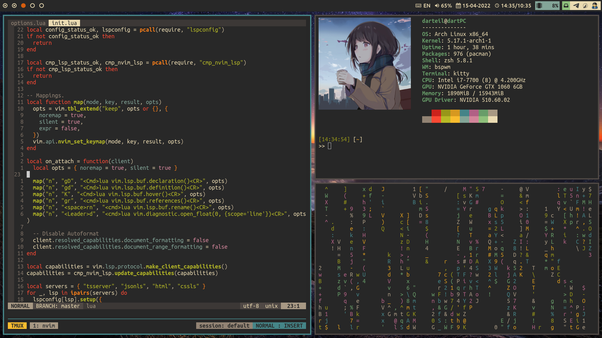
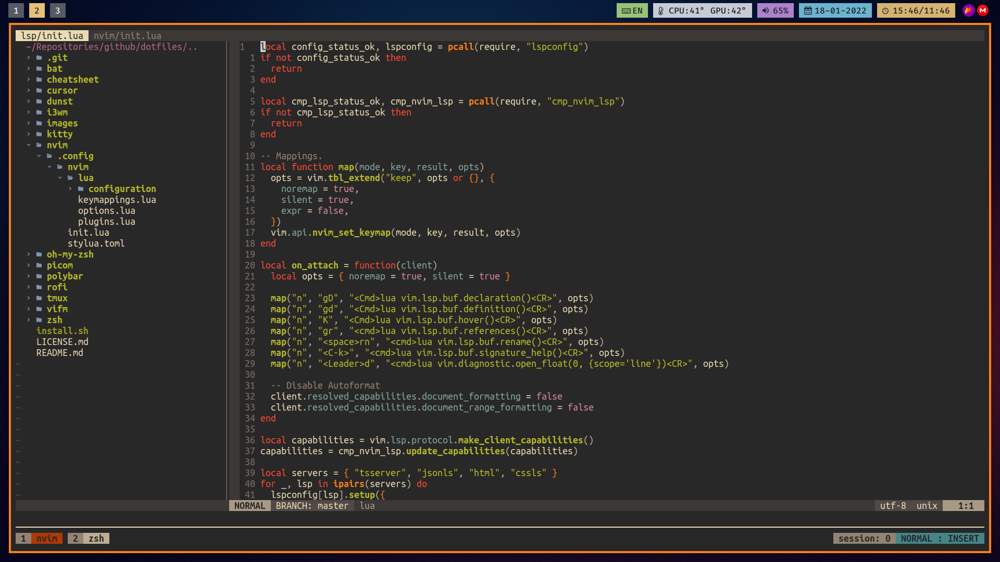
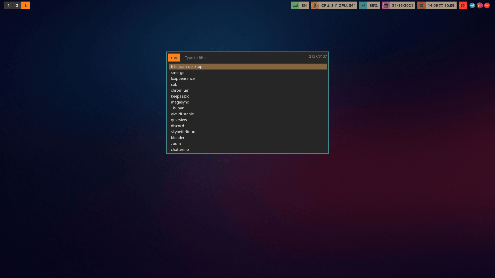

    <h1>.dotfiles</h1>
    

    
      
    

Dotfiles for unix, managed by [GNU stow](https://www.gnu.org/software/stow/).

### Programs

| Program                             | Name                                                                     |
| :---                                | :---                                                                     |
| Linux Distribution                  | [Arch Linux](https://www.archlinux.org/)                                 |
| Window Manager                      | [i3-gaps](https://github.com/Airblader/i3)                               |
| Bar                                 | [polybar](https://github.com/jaagr/polybar)                              |
| Program Launcher                    | [rofi](https://github.com/DaveDavenport/rofi)                            |
| Wallpaper Setter                    | [feh](https://github.com/derf/feh)                                       |
| Web Browser                         | [Vivaldi](https://vivaldi.com)                                           |
| Code Editor                         | [Nvim](https://neovim.io/)                                               |
| Shell                               | [zsh](https://www.zsh.org/)                                              |
| Terminal Emulator                   | [Kitty](https://sw.kovidgoyal.net/kitty/)                                |
| File manager                        | [Vifm](https://vifm.info)                                                |

### Dotfiles manager

Tutorials for GNU stow:  
[Using GNU Stow to manage your dotfiles](http://brandon.invergo.net/news/2012-05-26-using-gnu-stow-to-manage-your-dotfiles.html)  
[Managing Dotfile Symlinks with GNU Stow](https://spin.atomicobject.com/2014/12/26/manage-dotfiles-gnu-stow/)

### Screenshots

### License

MIT License, Copyright (c) 2019-2021 Romanov Yuri
